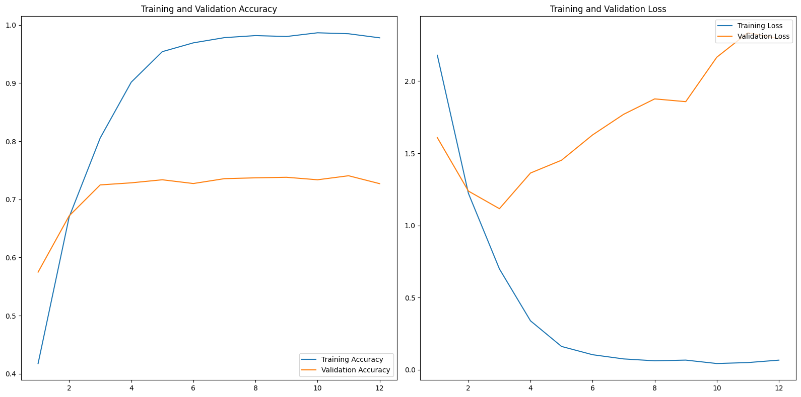
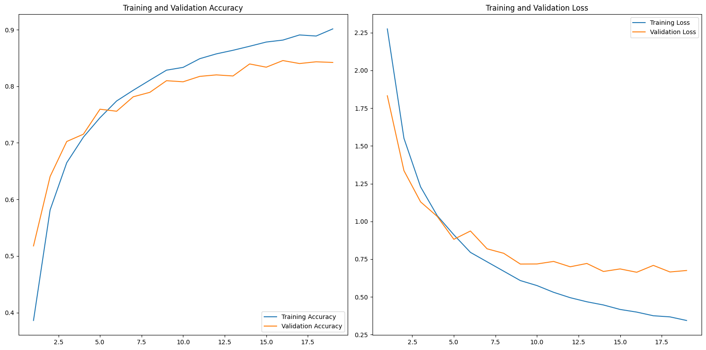

# simpson-classification

Ce projet propose deux modèles CNN (réseau de neurones convolutif) pour la classification des personnages des Simpson : un modèle CNN simple et un modèle CNN utilisant des techniques de Data Augmentation et Dropout.

## Dataset d'images 

Le dataset d'images est disponible sur [Kaggle](https://www.kaggle.com/datasets/alexattia/the-simpsons-characters-dataset). Il contient plus de 20 000 images de 42 personnages des Simpson. 

## Bibliothèques Utilisées
  
- **TensorFlow / Keras :** pour la construction et l'entraînement des réseaux de neurones

- **Numpy / Matplotlib.pyplot :** pour la manipulation des données et la visualisation graphique.

## Structure du Projet

Le projet est organisé comme suit :
- **simpsons_classification.ipynb :** Jupyter Notebook contenant le code pour le classificateur de personnages Simpsons utilisant des réseaux de neurones convolutionnels (CNN).
- **/model :** Contient les sauvegardes des modèles CNN entraînés au format h5, ainsi que les fichiers CSV pour les métriques.
- **/media :** Emplacement pour stocker les graphiques de performance des modèles et quelques exemples de prédiction d'image.

## Exemples de prédiction

## Comparaison des modèles 
Les graphiques montrent les métriques d'accuracy et de loss pour l'ensemble de données d'entraînement et de validation des deux modèles :

**CNN simple - Précision de 73.56%**

On remarque que val_accuracy (la précision sur le dataset de validation) tend vers 0.72 au fur et à mesures de l'entraînement du modèle tandis que train_accuracy (la précision sur le dataset d'entraînement) continue d'augmenter jusqu'à quasiment 1. 
On a un phénomène d'overfitting : le modèle mémorise les détails spécifiques des données d'entraînement au lieu d'apprendre des caractéristiques générales. Cela se traduit par une faible capacité à généraliser, c'est-à-dire à bien se comporter sur de nouvelles données. On peut le voir sur le graphique d'erreurs.

**CNN avec Data Augmentation et Dropout - Précision de 83.95%**

La Data Augmentation enrichit le jeu de données en appliquant des transformations aléatoires aux images d'entraînement, ce qui expose le modèle à une plus grande variété de cas. 
Le Dropout, quant à lui, consiste à aléatoirement désactiver un pourcentage des neurones pendant l'entraînement, forçant ainsi le réseau à ne pas trop s'appuyer sur des activations spécifiques.
La combinaison de ces techniques dans le modèle avec Data Augmentation et Dropout permet généralement d'améliorer la capacité du modèle à généraliser et donc à réguler l'overfitting. On peut le voir sur les graphiques, l'écart entre val_accuracy et train_accuracy a fortement diminuté, pareil pour l'erreur.
